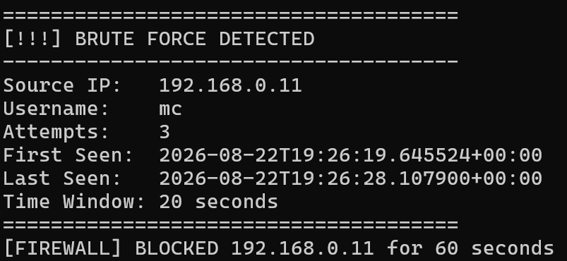
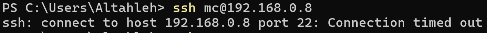
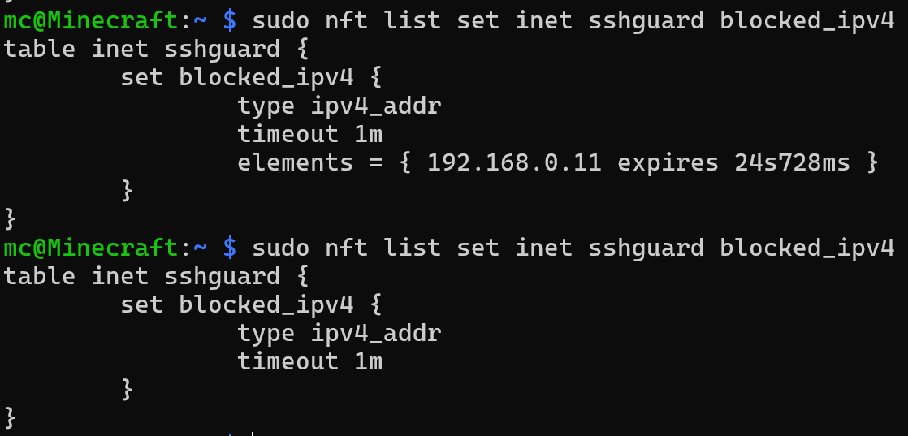
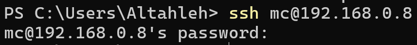

# SSHGuard

Real-Time SSH Brute-Force Detection & Automatic Blocking System

## Overview

SSHGuard is a defensive cybersecurity graduation project designed to detect repeated failed SSH authentication attempts and automatically apply temporary firewall blocks against suspicious source IP addresses.

The system monitors OpenSSH authentication events in real time through the systemd journal, normalizes relevant events, tracks failed login attempts separately for each source IP, evaluates them using a configurable sliding time window and threshold, and triggers an automated nftables response when brute-force behavior is detected.

The project is currently deployed and tested on a Raspberry Pi 4 running Debian 13.

---

## Team

- Mohammed Jumaa Al-Tahla
- Nada
- Doha

---

## Current Features

- Real-time OpenSSH event monitoring
- systemd journal integration
- Failed SSH login detection
- Successful SSH login monitoring
- Invalid username identification
- SSH event normalization
- Per-source-IP failed-attempt tracking
- Configurable brute-force threshold
- Configurable sliding time window
- Duplicate incident suppression
- Dry-run response mode
- Real automated firewall response
- Temporary nftables IP blocking
- Automatic firewall block expiration
- Tailscale management-path protection
- Persistent SQLite security-event storage
- Versioned read-only FastAPI
- React and TypeScript monitoring dashboard
- Live dashboard updates through Server-Sent Events
- Automatic live-stream reconnection and offline status
- Synthetic detector testing
- Real end-to-end SSH testing

---

## Architecture

```text
SSH Client
    |
    v
OpenSSH Server
    |
    v
systemd journal
    |
    v
SSH Event Parser
    |
    v
Normalized Events
    |
    v
Brute-Force Detector
    |
    v
Security Incident
    |
    v
Firewall Manager
    |
    v
nftables Temporary Block
```

The monitoring path is deliberately separated from the response path:

```text
SSHGuard Core
    |
    v
SQLite Event Store
    |
    +--> FastAPI REST snapshots --> React Dashboard
    |
    +--> SSE change signal ------> Live refresh
```

The live stream sends a small change notification rather than duplicating
security records inside the stream. A client that receives the notification
fetches a fresh typed snapshot from the versioned REST API. This keeps the
same contract reusable by the web dashboard and a future Windows client.

The dashboard API remains read-only and does not execute nftables commands.

Live-update timing can be configured with:

```text
SSHGUARD_LIVE_POLL_SECONDS=1.0
SSHGUARD_LIVE_HEARTBEAT_SECONDS=15.0
```

The stream endpoint is:

```text
GET /api/v1/events/stream
Content-Type: text/event-stream
```

---

## How Detection Works

SSHGuard tracks failed SSH authentication attempts independently for each source IP address.

The detector uses two main values:

- **Threshold**: The number of failed authentication attempts required to trigger detection.
- **Time Window**: The period of time during which those failed attempts must occur.

Example configuration:

```text
Threshold: 3 attempts
Time Window: 20 seconds
```

If the same source IP generates three failed SSH authentication attempts within 20 seconds, SSHGuard creates a brute-force incident.

SSHGuard uses a **sliding time window**.

Old authentication attempts that fall outside the active time window are automatically removed from the current calculation.

Example:

```text
10:00:00 Failed
10:00:05 Failed
10:00:12 Failed
```

With the following configuration:

```text
Threshold: 3
Time Window: 20 seconds
```

the result is:

```text
3 failed attempts
within 20 seconds
=
Brute-force detected
```

Attempts are tracked separately for each source IP.

For example:

```text
192.168.0.10 → 2 failures
192.168.0.11 → 1 failure
```

These are not combined into three attempts because they originate from different source IP addresses.

---

## SSH Event Processing

Raw OpenSSH authentication messages are read directly from the systemd journal.

Example raw event:

```text
Failed password for user from 192.168.0.11 port 50500 ssh2
```

The SSH Event Parser converts the raw message into a normalized event containing structured information such as:

```text
event_type
username
source_ip
source_port
timestamp
invalid_user
```

This allows the Detection Engine to operate on structured events instead of processing raw OpenSSH text directly.

The architecture separates responsibilities:

```text
Raw SSH Log
    ↓
SSH Event Parser
    ↓
Normalized Event
    ↓
Detection Engine
```

The Parser identifies what happened.

The Detection Engine decides whether the observed behavior represents brute-force activity.

---

## Events Currently Monitored

SSHGuard currently recognizes:

- Failed password authentication
- Successful password authentication
- Invalid username attempts

Failed authentication events are passed to the brute-force Detection Engine.

Successful login events are monitored and displayed but are not counted toward the brute-force threshold.

SSHGuard also avoids counting multiple raw log messages representing the same authentication attempt as separate failed attempts.

---

## Detection Engine

The Detection Engine maintains temporary state for each source IP.

Conceptually:

```text
192.168.0.10
├── 10:00:01
├── 10:00:07
└── 10:00:13

192.168.0.11
├── 10:00:04
└── 10:00:11
```

When a new failed login arrives, the detector:

1. Identifies the source IP.
2. Adds the new event timestamp to that IP's state.
3. Calculates the beginning of the current sliding time window.
4. Removes failed attempts older than the active window.
5. Counts the remaining attempts.
6. Compares the count to the configured threshold.
7. Generates a brute-force incident if the threshold has been reached.

---

## Duplicate Incident Suppression

SSHGuard prevents repeated alerts from being created for every additional failed attempt during the same continuous attack.

Example:

```text
Attempt 1 → 1/3
Attempt 2 → 2/3
Attempt 3 → 3/3 → INCIDENT CREATED
Attempt 4 → INCIDENT ALREADY ACTIVE
Attempt 5 → INCIDENT ALREADY ACTIVE
```

This reduces unnecessary alert duplication.

When the attack activity falls below the configured detection threshold after the sliding window advances, the previous incident can become inactive and the source can later generate a new incident if another attack begins.

---

## Automated Firewall Response

SSHGuard supports two response modes.

### Dry-Run Mode

The system detects brute-force activity and reports what action would have been performed, but it does not modify the firewall.

Example:

```text
[DRY RUN] Would block IP: 192.168.0.11 for 60 seconds
```

Dry-Run mode is useful during development and testing because it allows detection logic to be validated safely before enabling real firewall modifications.

---

### Real Mode

When Real mode is enabled, SSHGuard creates and manages its own nftables firewall table.

A detected IPv4 or IPv6 source address is inserted into the
matching temporary nftables set.

SSH traffic from the blocked source IP to the configured protected SSH port is dropped.

Example:

```text
[FIREWALL] BLOCKED 192.168.0.11 for 60 seconds
```

The blocked IP is automatically removed after the configured timeout.

---

## Automatic Block Expiration

SSHGuard uses nftables timeout functionality.

Instead of making Python wait and manually remove the firewall rule later, nftables itself manages block expiration.

Conceptually:

```text
IP added to blocked set
        ↓
Temporary timeout begins
        ↓
SSH traffic is dropped
        ↓
Timeout expires
        ↓
IP automatically removed
```

This design improves reliability because the temporary firewall block can still expire even if the Python process stops after applying the block.

---

## Firewall Safety

SSHGuard manages its own nftables table:

```text
inet sshguard
```

The project does not flush or replace the complete system firewall.

This prevents SSHGuard from unnecessarily interfering with existing configurations such as:

- UFW
- Docker networking
- Tailscale
- Other firewall rules

The current firewall architecture also excludes traffic arriving through the Tailscale interface from SSHGuard blocking.

Tailscale is currently used as an administrative and recovery path.

---

## Real Test Configuration

The current end-to-end testing configuration uses:

```text
Threshold: 3 failed attempts
Time Window: 20 seconds
Block Duration: 60 seconds
Protected SSH Port: 22
```

These values are currently configured for testing and demonstration purposes and can be modified.

---

## Real Test Scenario

During controlled testing:

1. A client generated three failed SSH authentication attempts.
2. SSHGuard received the events from the OpenSSH systemd journal.
3. The SSH Event Parser normalized the events.
4. The Detection Engine tracked the attempts for the source IP.
5. The configured threshold was reached inside the 20-second sliding time window.
6. A brute-force incident was generated.
7. The source IP was automatically added to the nftables temporary block set.
8. New SSH connections from the blocked source timed out.
9. The source remained blocked for the configured 60-second duration.
10. nftables automatically removed the source IP after the timeout.
11. SSH connectivity became available again.

---

## Testing Evidence

The following screenshots demonstrate the real end-to-end behavior of SSHGuard during controlled testing.

### 1. Brute-Force Detection and Automatic Blocking

SSHGuard detected three failed SSH authentication attempts from the same source IP within the configured 20-second sliding time window.

The system generated a brute-force incident and automatically blocked the source IP for 60 seconds.



---

### 2. SSH Connection Blocked

After the firewall response was applied, new SSH connections from the blocked client were no longer able to reach the SSH service.



---

### 3. nftables Block Lifecycle

The attacking source IP appeared inside the SSHGuard `blocked_ipv4` nftables set with an active expiration timer.

After the configured block duration expired, nftables automatically removed the IP from the set.



---

### 4. SSH Connectivity Restored

After the temporary firewall block expired, the same client was able to reach the SSH authentication prompt again.



---

## Validation Result

The controlled test successfully validated the complete SSHGuard response lifecycle:

```text
Failed SSH Authentication Attempts
        ↓
Sliding Window Detection
        ↓
Brute-Force Incident
        ↓
Automatic nftables Block
        ↓
SSH Connection Prevented
        ↓
Automatic Block Expiration
        ↓
SSH Connectivity Restored
```

This confirms that SSHGuard successfully detects repeated SSH authentication failures, applies a temporary automated firewall response, and restores connectivity after the configured timeout.

---

## Example Detection Output

```text
[FAILED LOGIN] IP=192.168.0.11 USER=mc
[DETECTOR] IP=192.168.0.11 ATTEMPTS=1/3

[FAILED LOGIN] IP=192.168.0.11 USER=mc
[DETECTOR] IP=192.168.0.11 ATTEMPTS=2/3

[FAILED LOGIN] IP=192.168.0.11 USER=mc
[DETECTOR] IP=192.168.0.11 ATTEMPTS=3/3

======================================
[!!!] BRUTE FORCE DETECTED
--------------------------------------
Source IP:   192.168.0.11
Username:    mc
Attempts:    3
Time Window: 20 seconds
======================================

[FIREWALL] BLOCKED 192.168.0.11 for 60 seconds
```

While the block is active:

```text
ssh: connect to host 192.168.0.8 port 22: Connection timed out
```

After the configured timeout expires, SSH connectivity becomes available again.

---

## Project Structure

```text
sshguard/
├── main.py
├── config.py
├── core/
│   ├── __init__.py
│   ├── log_parser.py
│   ├── detector.py
│   └── firewall.py
├── tests/
│   ├── __init__.py
│   └── test_detector.py
├── docs/
│   └── screenshots/
│       ├── 01-brute-force-detected.png
│       ├── 02-ssh-connection-blocked.png
│       ├── 03-nftables-block-lifecycle.png
│       └── 04-ssh-connectivity-restored.png
├── .gitignore
└── README.md
```

---

## Main Components

### `main.py`

The main application entry point.

Responsibilities:

- Initializes the Detection Engine
- Initializes the Firewall Manager
- Starts real-time SSH event monitoring
- Displays normalized authentication events
- Sends events to the Detection Engine
- Processes detected brute-force incidents
- Triggers the configured automated response

---

### `config.py`

Stores configurable SSHGuard settings.

Current configuration includes:

- Brute-force threshold
- Sliding time-window duration
- Firewall block duration
- Protected SSH port
- Response mode
- Whitelisted management networks

---

### `core/log_parser.py`

Responsible for:

- Reading OpenSSH events from the systemd journal
- Parsing authentication messages
- Detecting failed authentication events
- Detecting successful authentication events
- Detecting invalid usernames
- Extracting source information
- Creating normalized SSH events

---

### `core/detector.py`

Responsible for:

- Tracking failed login attempts per source IP
- Maintaining per-IP state
- Applying sliding time-window logic
- Removing expired authentication attempts
- Comparing attempt counts against the configured threshold
- Generating brute-force incidents
- Suppressing duplicate incidents during the same continuous attack

---

### `core/firewall.py`

Responsible for:

- Managing the SSHGuard nftables table
- Supporting Dry-Run and Real response modes
- Checking whitelisted management networks
- Temporarily blocking malicious source IPs
- Protecting the configured SSH service
- Supporting automatic timeout-based block expiration
- Supporting manual unblock operations

---

### `tests/test_detector.py`

Contains synthetic tests for the Detection Engine.

The detector can therefore be tested independently from:

- OpenSSH
- systemd journal
- Real network traffic
- Firewall rules

This helps isolate Detection Engine bugs from other system components.

---

## Requirements

Current development environment:

- Raspberry Pi 4
- Debian GNU/Linux 13
- Python 3.13+
- OpenSSH Server
- systemd
- nftables
- Git

Real firewall response requires elevated privileges.

No third-party Python packages are currently required by the core SSHGuard implementation.

---

## Running SSHGuard

Enter the project directory:

```bash
cd sshguard
```

Run SSHGuard:

```bash
sudo python3 main.py
```

When SSHGuard starts, the current configuration is displayed.

Example:

```text
======================================
 SSHGuard
 Brute-Force Detection
 & Automatic Blocking System
======================================

Threshold:       3
Time Window:     20s
Block Duration:  60s
SSH Port:        22
Response Mode:   REAL
```

---

## Configuration

Core configuration is stored in:

```text
config.py
```

Example:

```python
THRESHOLD = 3
WINDOW_SECONDS = 20

BLOCK_DURATION_SECONDS = 60

PROTECTED_SSH_PORT = 22

RESPONSE_MODE = "dry-run"

WHITELIST_NETWORKS = [
    "100.64.0.0/10",
    "127.0.0.0/8",
]
```

---

## Response Modes

### Dry-Run

```python
RESPONSE_MODE = "dry-run"
```

SSHGuard performs detection but does not modify nftables.

---

### Real Response

```python
RESPONSE_MODE = "real"
```

SSHGuard automatically applies temporary firewall blocks after brute-force detection.

Always verify administrative and recovery access before enabling Real mode.

---

## Detector Testing

Run the Detection Engine test module from the project root:

```bash
python3 -m tests.test_detector
```

Current synthetic tests validate behavior including:

- Per-IP failed-attempt tracking
- Sliding time-window behavior
- Threshold detection
- Independent tracking of multiple source IPs
- Successful login events not increasing the failed-attempt counter

---

## Inspecting SSHGuard Firewall State

Display the complete SSHGuard nftables table:

```bash
sudo nft list table inet sshguard
```

Display currently blocked IPv4 addresses:

```bash
sudo nft list set inet sshguard blocked_ipv4
```

Display currently blocked IPv6 addresses:

```bash
sudo nft list set inet sshguard blocked_ipv6
```

Example:

```text
table inet sshguard {
    set blocked_ipv4 {
        type ipv4_addr
        timeout 1m
        elements = {
            192.168.0.11 expires 24s
        }
    }
}
```

The same table contains a `blocked_ipv6` set with type
`ipv6_addr`. Existing IPv4-only SSHGuard tables are upgraded
in place when the service starts; active IPv4 timeout state is
not flushed.

After the timeout expires, the source address is automatically removed.

---

## Removing the SSHGuard Firewall Table

If the SSHGuard firewall table needs to be removed manually:

```bash
sudo nft delete table inet sshguard
```

This removes only the nftables table created by SSHGuard.

It does not flush the entire system firewall.

---

## Security Considerations

SSHGuard is intended strictly for defensive cybersecurity use.

All testing must be performed only on systems owned by the project team or systems for which explicit authorization has been provided.

The repository must never contain:

- Real passwords
- SSH private keys
- API credentials
- Personal Access Tokens
- Sensitive authentication information
- Private environment files
- Real captured credentials

SSHGuard does not store SSH passwords.

---

## GitHub Repository Safety

Sensitive files should not be committed to Git.

The project's `.gitignore` currently excludes files such as:

```text
__pycache__/
*.pyc
.venv/
venv/
*.db
*.sqlite
*.sqlite3
*.log
.env
.env.*
```

Before every important push, developers should verify the staged files using:

```bash
git status
```

---

## Current Development Status

### Completed

- Real-time OpenSSH journal monitoring
- Failed-login parsing
- Successful-login parsing
- Invalid-user identification
- SSH event normalization
- Per-source-IP tracking
- Sliding time-window detection
- Configurable brute-force threshold
- Configurable block duration
- Brute-force incident generation
- Duplicate incident suppression
- Synthetic Detection Engine testing
- Real SSH end-to-end testing
- Dry-Run response mode
- Real nftables automated response
- Temporary IP blocking
- Automatic firewall block expiration
- Protected Tailscale management path
- Git repository initialization
- GitHub repository integration
- Real testing evidence
- Read-only FastAPI dashboard API
- React and TypeScript dashboard MVP
- Overview, Incidents, Authentication, Firewall Actions, and Analytics pages
- Live SSE change notifications
- Automatic dashboard refresh and stream reconnection
- Project branding and About page

---

### In Progress

- Controlled analyst-response workflow
- Authentication and role-based access control
- Audited manual unblock design
- Additional documentation
- Final demonstration environment

---

### Planned Improvements

Possible future improvements include:

- Authenticated active-block management
- Audited manual unblock requests
- SOC analyst incident triage
- Human-guided incident summaries
- Additional SSH event analysis
- Multiple protected services
- Alert notifications
- Extended reporting
- Deployment as a persistent Linux service
- Improved configuration management
- Additional automated test cases

---

## Educational Goals

SSHGuard is being developed as a cybersecurity graduation project.

The project demonstrates practical understanding of:

- Linux authentication logging
- OpenSSH
- systemd journal
- Python
- Regular Expressions
- Event parsing
- Event normalization
- Stateful detection
- Per-IP tracking
- Sliding time windows
- Brute-force detection
- Incident generation
- Automated defensive response
- Linux firewall management
- nftables
- Testing and validation
- Git
- GitHub
- Secure development practices

---

## Disclaimer

SSHGuard is an educational defensive-security project.

Use it only on systems you own or are explicitly authorized to test.

Unauthorized testing or attacks against third-party systems are not supported by this project.
